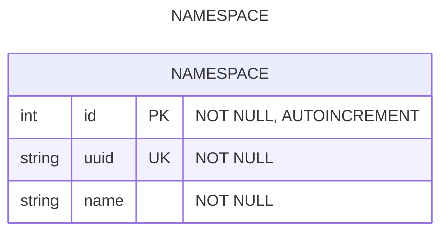

# Database-Schema

Kodiak's database schema, still WIP.

```mermaid
---
title: NAMESPACE
---
erDiagram
    NAMESPACE {
        int    id   PK "NOT NULL, AUTOINCREMENT"
        string uuid UK "NOT NULL"
        string name    "NOT NULL"
    }
```

# Links

[ER diagrams with Mermaid](https://mermaid.js.org/syntax/entityRelationshipDiagram.html)
