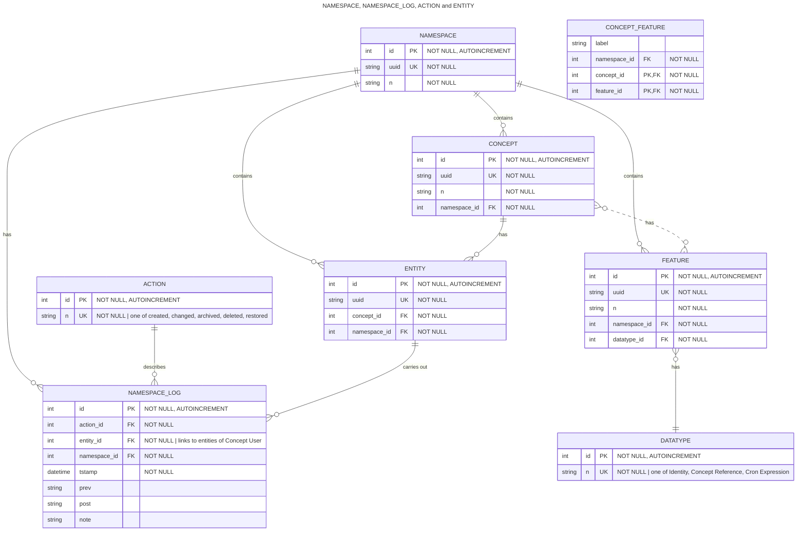

# Database-Schema

Kodiak's database schema, still WIP.

Conventions:

* Naming:
  * table names: nouns, singular, all capital letters
  * FK: always use the name of the target table + _ + id (all lowercase letters)
* Ordering of columns:
  * first: Primary Key (PK)
  * second (optional): Unique Key (UK) 
  * following (optional): Foreign Key(s) (FK) (sorted alphabetically)
  * data columns: use sensible order, not necessarily alphabetically

# Links

[ER diagrams with Mermaid](https://mermaid.js.org/syntax/entityRelationshipDiagram.html)
