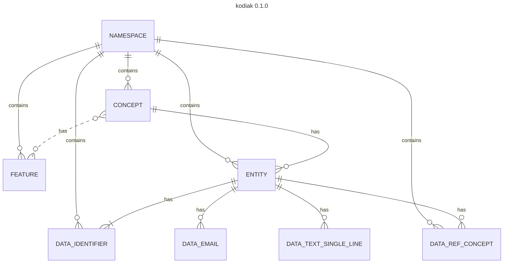
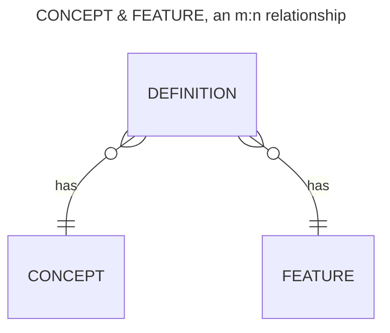

# Entity-relationship model (ER-model)

Kodiak's ER model is simple but opens up powerful capabilities. Let's point out the most 
important aspects. Please note that in an ER model, each entity is represented by a single 
box. Kodiak manages also entities, which are depicted as ENTITY in the ER model. 
Don't get confused by this overlapping terminology.

1. All entities (CONCEPT, FEATURE, ENTITY and so on) are related to a NAMESPACE. 
NAMESPACEs are at the topmost hierarchy level in Kodiak. Relating all entities 
to a NAMESPACE is in preparation for scalability as it allows us to partition 
the tables effectively in large scale deployments.
2. CONCEPT and FEATURE have an n:m relationship. This allows us to reliably manage 
data across different CONCEPTs, e.g. compare entities of different concepts to each
other.
3. Kodiak offers powerful, high-level data types. From an ER model perspective, 
each data type is its own ENTITY as the relationship with the ENTITY depends on the 
data type.

# Links

[ER diagrams with Mermaid](https://mermaid.js.org/syntax/entityRelationshipDiagram.html)
