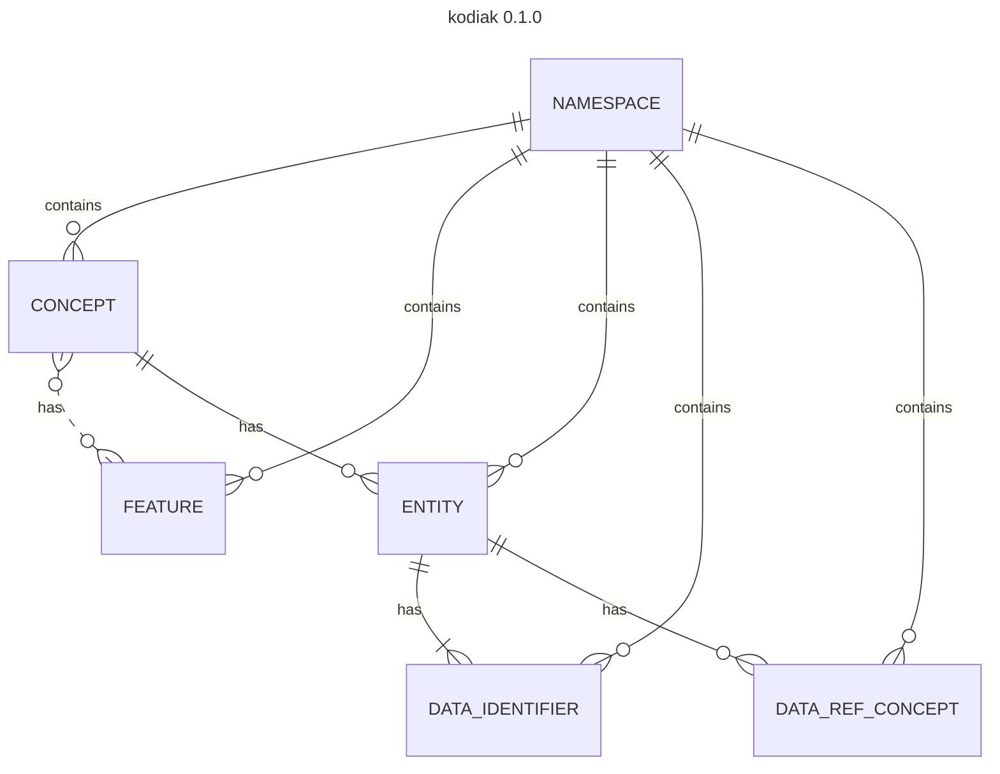
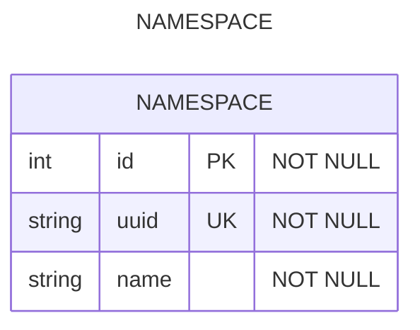

# kodiak-er-model
kodiak's entity–relationship model

```mermaid
---
title: kodiak 0.1.0
---
erDiagram
    NAMESPACE ||--o{ CONCEPT : contains
    NAMESPACE ||--o{ FEATURE : contains
    NAMESPACE ||--o{ ENTITY : contains
    NAMESPACE ||--o{ DATA_IDENTIFIER : contains
    NAMESPACE ||--o{ DATA_REF_CONCEPT : contains
    CONCEPT }o..o{ FEATURE : has
    CONCEPT ||--o{ ENTITY : has
    ENTITY ||--|{DATA_IDENTIFIER: has
    ENTITY ||--o{DATA_REF_CONCEPT: has
```

```mermaid
---
title: NAMESPACE
---
erDiagram
    NAMESPACE {
        int    id   PK "NOT NULL"
        string uuid UK "NOT NULL"
        string name    "NOT NULL"
    }
```

# Links

(https://mermaid.js.org/syntax/entityRelationshipDiagram.html)[ER diagrams with Mermaid]
