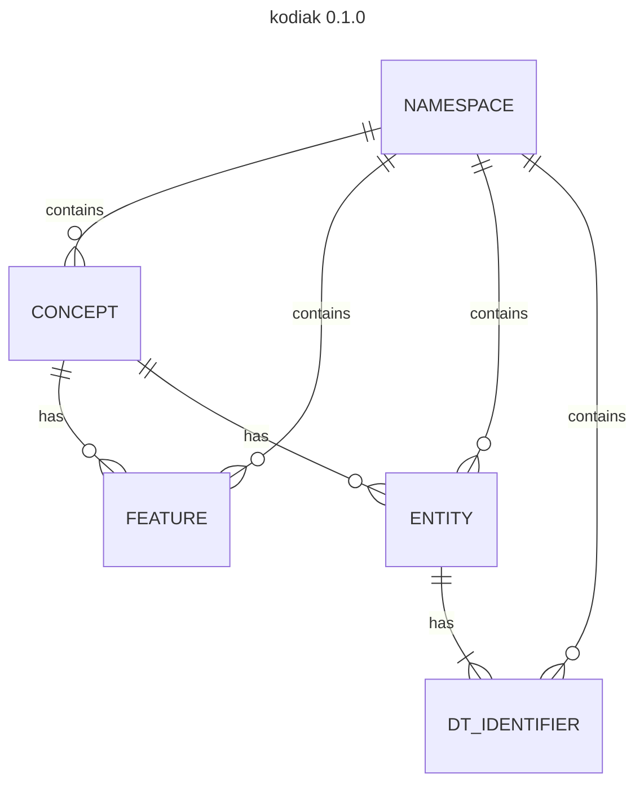

# kodiak-er-model
kodiak's entity–relationship model

```mermaid
---
title: kodiak 0.1.0
---
erDiagram
    NAMESPACE ||--o{ CONCEPT : contains
    NAMESPACE ||--o{ FEATURE : contains
    NAMESPACE ||--o{ ENTITY : contains
    NAMESPACE ||--o{ DT_IDENTIFIER : contains
    CONCEPT ||--o{ FEATURE : has
    CONCEPT ||--o{ ENTITY : has
    ENTITY ||--|{DT_IDENTIFIER: has
```
