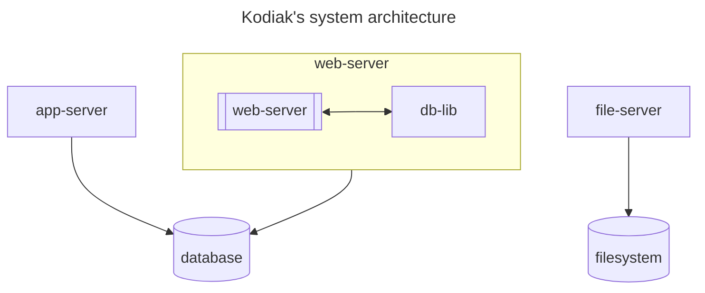
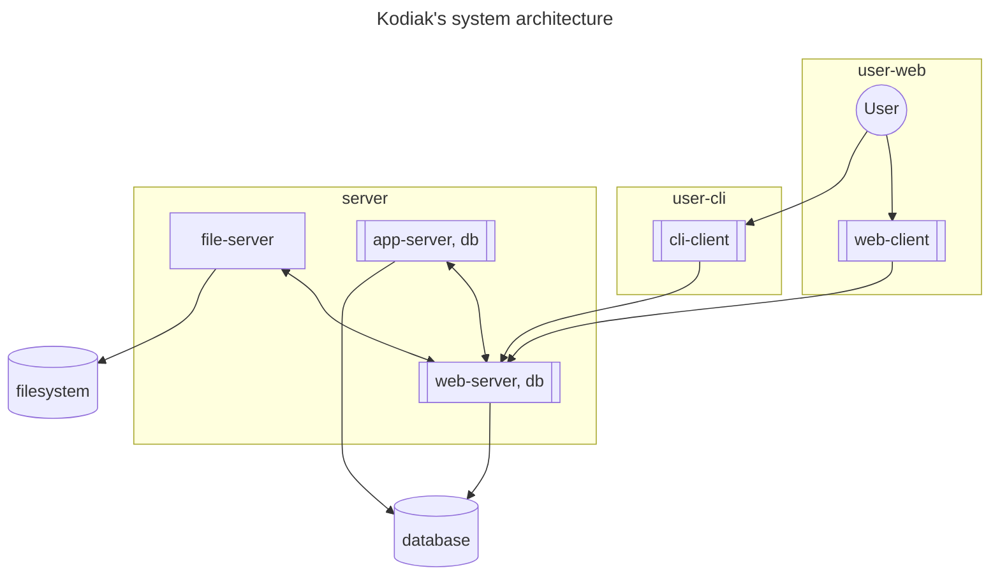

# System architecture

Kodiak's system architecture, still WIP.

```mermaid
---
title: Kodiak's system architecture
---
flowchart TB
  direction TB
  subgraph web-server
    web-server.pro[[web-server]] <--> db-lib
  end
  file-server --> filesystem[(filesystem)]
  web-server --> database[(database)]
  app-server --> database[(database)]
```

Target picture:

```mermaid
---
title: Kodiak's system architecture
---
flowchart TB
  direction LR
  subgraph user-web
    user((User)) --> web-client[[web-client]]
  end
  direction RL
  subgraph user-cli
    user((User)) --> cli-client[[cli-client]]
  end
  web-client --> web-server
  cli-client --> web-server
  direction LR
  subgraph server
    file-server <--> web-server
    app-server[[app-server, db]] <--> web-server[[web-server, db]]
  end
  file-server --> file-system[(filesystem)]
  web-server --> database[(database)]
  app-server --> database[(database)]
```
