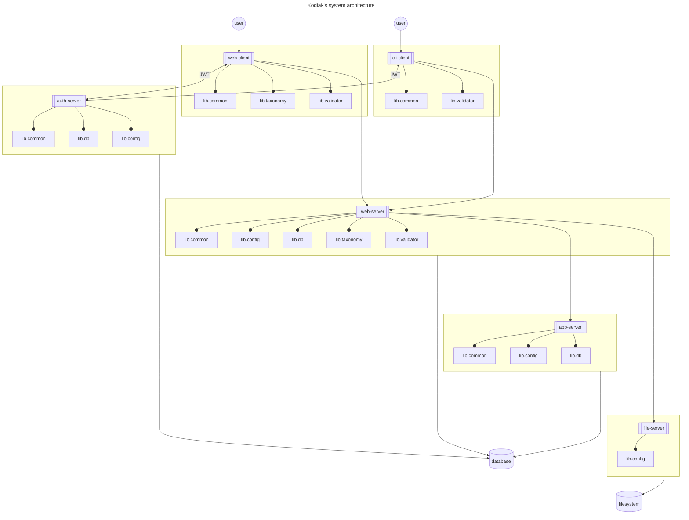

# System architecture

Kodiak's system architecture, draft.

```mermaid
---
title: Kodiak's system architecture
---
flowchart TB
  subgraph user-web[ ]
    direction TB  
    web-client[[web-client]] --o web-client.lib.common[lib.common]
    web-client               --o web-client.lib.taxonomy[lib.taxonomy]
    web-client               --o web-client.lib.validator[lib.validator]
  end
  subgraph user-cli[ ]
    direction TB
    cli-client[[cli-client]] --o cli-client.lib.common[lib.common]
    cli-client               --o cli-client.lib.validator[lib.validator]
  end
  subgraph auth-server[ ]
    direction TB
    auth-server.api[[auth-server]] --o auth-server.lib.common[lib.common]
    auth-server.api                --o auth-server.lib.db[lib.db]
    auth-server.api                --o auth-server.lib.config[lib.config]
  end
  subgraph file-server[ ]
    direction TB
    file-server.api[[file-server]] --o file-server.lib.config[lib.config]
  end
  subgraph web-server[ ]
    direction TB
    web-server.api[[web-server]] --o web-server.lib.common[lib.common]
    web-server.api               --o web-server.lib.config[lib.config]
    web-server.api               --o web-server.lib.db[lib.db]
    web-server.api               --o web-server.lib.taxonomy[lib.taxonomy]
    web-server.api               --o web-server.lib.validator[lib.validator]
  end
  subgraph app-server[ ]
    direction TB
    app-server.api[[app-server]] --o app-server.lib.common[lib.common]
    app-server.api               --o app-server.lib.config[lib.config]
    app-server.api               --o app-server.lib.db[lib.db]
  end
  web-user((user)) -->          web-client
  web-client       <-- JWT -->  auth-server.api
  web-client       ------>      web-server.api
  cli-user((user)) -->          cli-client
  cli-client       <-- JWT -->  auth-server.api
  cli-client       ------> web-server.api
  web-server.api   ------> app-server.api
  web-server.api   ------> file-server.api
  file-server      --->    filesystem[(filesystem)]
  auth-server      -->     database[(database)]
  web-server       ---->   database
  app-server       ------> database
  database         ~~~   filesystem
```
