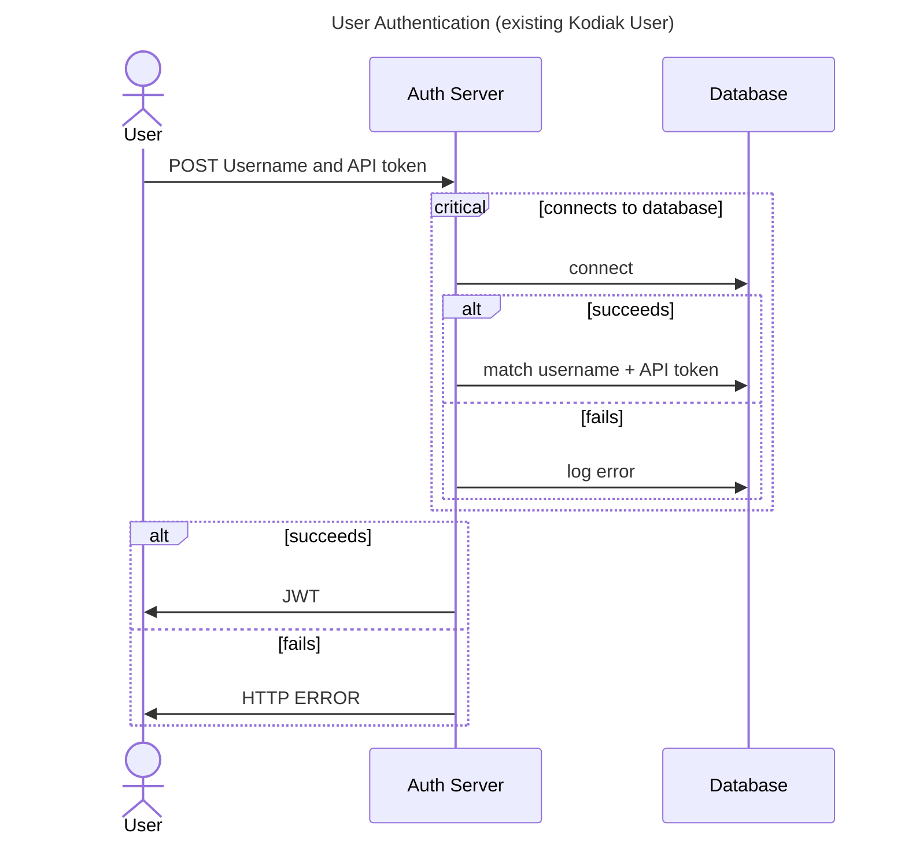

# User authentication of Kodiak's auth server

```mermaid
---
title: User Authentication (existing Kodiak User)
---
sequenceDiagram
    actor       U as User
    participant S as Auth Server
    participant D as Database
    U ->> S: POST Username and API token
    critical connects to database
        S ->>  D: connect
        alt succeeds
           S ->>  D: match username + API token
        else fails
           S ->>  D: log error
        end
    end
    alt succeeds
        S ->> U: JWT
    else fails
        S ->> U: HTTP ERROR
    end
```
