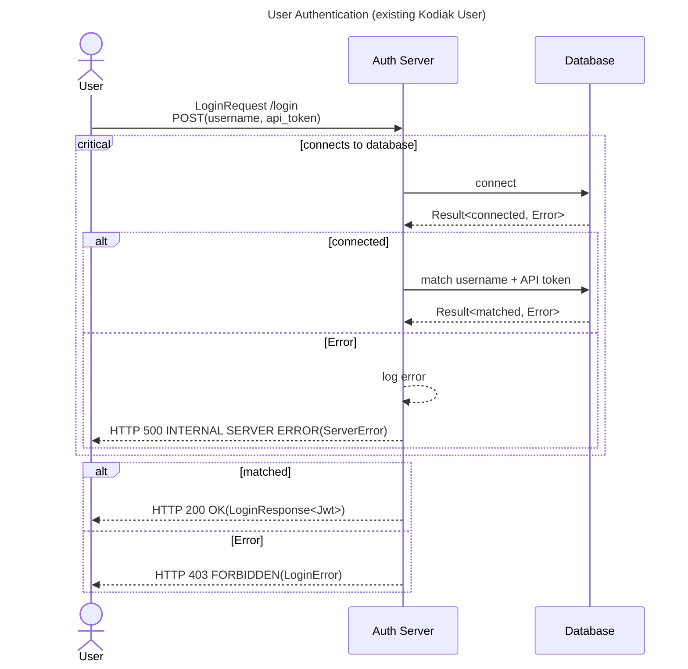

# User authentication of Kodiak's auth server

Thoughts:

- Kodiak uses HTTP 403 to indicate that a login request failed as opposed to 401 because `LoginRequest` is a POST request 
  to the server without any HTTP headers involved, neither in request nor in response.

# Links

[RFC9110 Client Error 4xx - 401 UNAUTHORIZED](https://www.rfc-editor.org/rfc/rfc9110#name-401-unauthorized)

[RFC9110 Client Error 4xx - 403 FORBIDDEN](https://www.rfc-editor.org/rfc/rfc9110#name-403-forbidden)

[RFC9110 Server Error 5xx - 500 INTERNAL SERVER ERROR](https://www.rfc-editor.org/rfc/rfc9110#name-500-internal-server-error)
